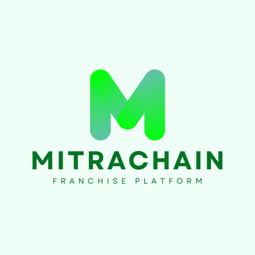

 

# MitraChain

<p align="center">

</p>

MitraChain is a **Web3-powered franchise platform** built on the Internet Computer (ICP). It connects **franchisors** and **franchisees** in a transparent, decentralized marketplace, enabling seamless business expansion and opportunity discovery.

---

## 🚀 Introduction

MitraChain’s vision is to revolutionize the franchise industry by creating a **transparent, efficient, and user-owned platform**. Powered by the Internet Computer (ICP), it leverages blockchain technology to provide a secure, decentralized ecosystem for franchise operations.

- **Franchisors** can showcase their brands and manage franchisee applications.
- **Franchisees** can explore, research, and apply for opportunities that align with their goals.

The platform is built with:

- **Motoko** for secure backend logic.
- **React (Vite + TypeScript)** for a modern, responsive frontend.
- **Multi-Wallet Integration** for secure authentication and asset management.

---

## 🎯 The Problem: Franchise Industry Challenges

The franchise industry faces inefficiencies that hinder growth and accessibility:

### Key Challenges:

- **Opaque Processes**: Lack of transparency in franchise agreements and operations.
- **High Barriers to Entry**: Complex application processes and high costs deter potential franchisees.
- **Centralized Platforms**: Traditional platforms charge high fees and control user data.
- **Trust Gaps**: Limited trust between franchisors and franchisees due to unverifiable information.

### The Result:

- Slowed business expansion.
- Missed opportunities for entrepreneurs.
- Reduced trust and inefficiencies in franchise operations.

---

## 💡 Our Solution

MitraChain is a decentralized platform that **streamlines** franchise discovery, **secures** transactions, and **builds trust** through blockchain technology.

### What We Offer:

- **🔍 Transparent Franchise Listings**: Franchisors create detailed listings with history, financials, and support details, stored immutably on-chain.
- **🤝 Secure Communication**: On-chain messaging ensures private, verifiable interactions between franchisors and franchisees.
- **📊 Advanced Search & Filtering**: Franchisees can search by industry, budget, location, and more.
- **✅ Standardized Applications**: A guided, multi-step application process simplifies franchisee onboarding.
- **🌟 Reputation System**: Verified reviews and ratings build trust and credibility.

---

## 🏛️ Architecture

MitraChain combines a modern frontend with a robust decentralized backend. Below is the high-level architecture diagram:

<p align="center">

</p>

- **Frontend**: Built with **React**, **Vite**, **TypeScript**, and **TailwindCSS** for a responsive and intuitive UI.
- **Backend**: Powered by **Motoko** on the Internet Computer (ICP) for secure, scalable, and decentralized logic.
- **Authentication**: Supports **Internet Identity**, **NFID**, and **Plug Wallet** for secure user access.

---

## 🌊 User Flow

The diagram below outlines the user journey on MitraChain, from registration to franchise application and management.

<p align="center">

</p>

---

## 🎨 Mockups

Below are mockups showcasing MitraChain’s user interface.

<details open>
<summary><strong>Click to expand and view all mockups</strong></summary>
<br>
<table>
<tr>
<td></td>
<td></td>
</tr>
<tr>
<td align="center"><em>Home Page</em></td>
<td align="center"><em>Franchisor Dashboard</em></td>
</tr>
<tr>
<td></td>
<td></td>
</tr>
<tr>
<td align="center"><em>Franchisee Dashboard</em></td>
<td align="center"><em>Franchise Listing</em></td>
</tr>
<tr>
<td></td>
<td></td>
</tr>
<tr>
<td align="center"><em>Search Page</em></td>
<td align="center"><em>Application Form</em></td>
</tr>
<tr>
<td></td>
<td></td>
</tr>
<tr>
<td align="center"><em>Messaging Interface</em></td>
<td align="center"><em>Login Page</em></td>
</tr>
</table>
</details>

---

## Project Structure

Here is an overview of MitraChain’s project structure:

```
MitraChain/
├── mitrachain-backend/
│   ├── src/
│   │   ├── main.mo         # Core canister logic
│   │   └── Types.mo        # Data models and type definitions
│
├── mitrachain-frontend/
│   ├── src/
│   │   ├── public/         # Static assets (logos, images)
│   │   └── ...             # React components, pages, and logic
│
└── README.md               # This file
```

---

## 🔧 Local Development Setup

To run MitraChain locally, follow these steps:

1. **Deploy the Backend Canister (ICP):**
   - Navigate to the backend directory:
     ```bash
     cd mitrachain-backend
     ```
   - Start a local ICP network:
     ```bash
     dfx start --clean --background
     ```
   - Generate canister declarations:
     ```bash
     dfx generate backend
     ```
   - Deploy the Motoko canister:
     ```bash
     dfx deploy
     ```

2. **Launch the Frontend Application:**
   - Navigate to the frontend directory:
     ```bash
     cd mitrachain-frontend
     ```
   - Install dependencies:
     ```bash
     npm install
     ```
   - Start the development server:
     ```bash
     npm run dev
     ```

3. **Configure Authentication:**
   - Ensure **Internet Identity** is set up for local development. Update the frontend configuration to point to the local canister ID:
     ```javascript
     // mitrachain-frontend/src/config.js
     export const canisterId =
       process.env.CANISTER_ID_BACKEND || process.env.VITE_BACKEND_CANISTER_ID;
     ```

   <details open>
   <summary>Click to see screenshot of the configuration</summary>
   <br>
   <b>Frontend Configuration</b>
   <br>
   
   </details>

---

## ✨ Features

### 🌐 Internet Computer (ICP) Features Used

- **Canister Development in Motoko**: Implements secure backend logic and data storage.
- **Persistent Storage**: Stores franchise listings, user profiles, and applications on-chain.
- **Authentication**: Integrates **Internet Identity**, **NFID**, and **Plug Wallet** for secure user authentication.

### 🛠️ Frontend Features

- **Responsive UI**: Built with **React**, **Vite**, and **TailwindCSS** for a modern, user-friendly experience.
- **Dynamic Dashboards**: Separate dashboards for franchisors (manage listings, applications) and franchisees (track applications, saved franchises).
- **Real-Time Messaging**: Secure, on-chain messaging between users.

---

## 🧗 Challenges Faced

Integrating **Motoko** with a modern **React** frontend required overcoming challenges due to limited documentation on ICP’s frontend-backend integration. Ensuring seamless multi-wallet support (Internet Identity, NFID, Plug Wallet) also required extensive testing to handle edge cases.

---

## 🔮 Future Plans

- **Mainnet Deployment**: Launch MitraChain on the ICP mainnet.
- **Enhanced Analytics**: Add data-driven insights for franchisors to track listing performance.
- **Mobile App**: Develop iOS and Android apps for broader accessibility.
- **DAO Governance**: Transition to a community-driven DAO for platform governance.
- **ICRC-1 Integration**: Support tokenized franchise assets for investment opportunities.

---

## 📈 Technical Difficulty

Building MitraChain was **moderately challenging** due to the integration of **Motoko** with a **React** frontend and the implementation of multi-wallet authentication. The on-chain messaging system, leveraging ICP’s canister architecture, was a particularly complex feature that required careful design to ensure scalability and security.
